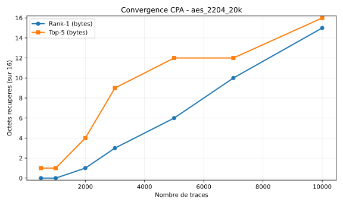
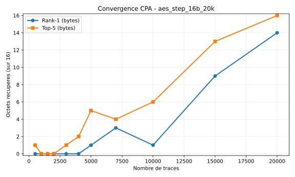
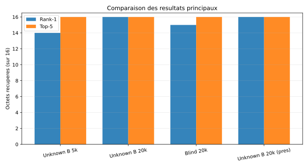
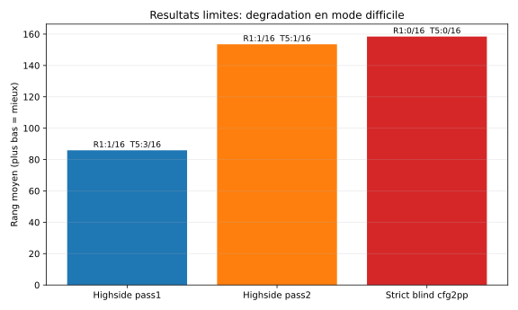

# Resultats

## Vue d'ensemble
L'evaluation montre une recuperation de cle AES tres solide sur les jeux de traces alignes, avec une recuperation complete (16/16 octets au rang 1) sur plusieurs scenarios a 20k traces. Les experiments en mode blind strict et en configuration highside deux-passes restent en revanche nettement plus difficiles, ce qui fournit une limite experimentale importante.

## Tableau des resultats clefs

| Experience | Traces | Rank-1 (sur 16) | Top-5 (sur 16) | Rang moyen |
|---|---:|---:|---:|---:|
| `unknown_B_5k_aligned_fullscan` | 5 000 | 14 | 16 | 1.1875 |
| `unknown_B_20k_aligned_fullscan` | 20 000 | 16 | 16 | 1.0000 |
| `pres_unknown_blind_20k` | 20 000 | 15 | 16 | 1.0625 |
| `pres_unknown_B_20k` | 20 000 | 16 | 16 | 1.0000 |
| `pres_unknown_new_20k` | 20 000 | 16 | 16 | 1.0000 |
| `highside_two_pass` (pass1) | 1 000 | 1 | 3 | 85.8750 |
| `highside_two_pass` (pass2) | 1 000 | 1 | 1 | 153.5000 |
| `strict_blind_B_cfg2pp_ensemble` (mean_score) | 15k attack | 0 | 0 | 158.4375 |

## Interpretation
1. **Resultat principal**: la cle est recuperee completement (16/16 rang 1) sur `unknown_B_20k_aligned_fullscan` et sur les deux scenarios de presentation (`pres_unknown_B_20k`, `pres_unknown_new_20k`).
2. **Effet du nombre de traces**: on observe un gain net entre 5k et 20k traces (14/16 -> 16/16 en rank-1) sur la meme famille de donnees `unknown_B`.
3. **Robustesse en blind**: `pres_unknown_blind_20k` reste tres performant (15/16 en rank-1, 16/16 en top-5), ce qui indique une attaque exploitable meme sans connaissance parfaite.
4. **Limites**: `highside_two_pass` et `strict_blind` confirment qu'en conditions plus dures, la methode actuelle ne converge pas correctement vers la cle complete.

## Figures (SVG)

### 1) Convergence - campagne `aes_2204`

Lecture: l'augmentation du nombre de traces fait monter rapidement le nombre d'octets recuperes en rank-1 et atteint 15/16 a 10k traces, avec 16/16 en top-5.

### 2) Convergence - campagne `aes_step_16b`

Lecture: la convergence existe mais est plus lente; le passage au voisinage de 15k-20k traces est necessaire pour stabiliser les octets au rang 1.

### 3) Comparaison des resultats principaux

Lecture: ce graphe resume l'ecart entre scenario 5k et 20k, et montre que le mode blind 20k reste tres proche du scenario non blind.

### 4) Resultats limites (negatifs)

Lecture: le rang moyen eleve en `highside_two_pass` (surtout pass2) et en `strict_blind` met en evidence les conditions ou l'attaque n'est pas encore fiable.

## Message a garder pour la conclusion
La methode est **efficace et reproductible** sur des jeux alignes avec un budget de traces suffisant (20k), tout en gardant une bonne performance en blind. En revanche, les pipelines highside/deux-passes et blind strict constituent encore des **verrous de robustesse** a traiter pour generaliser l'attaque.
